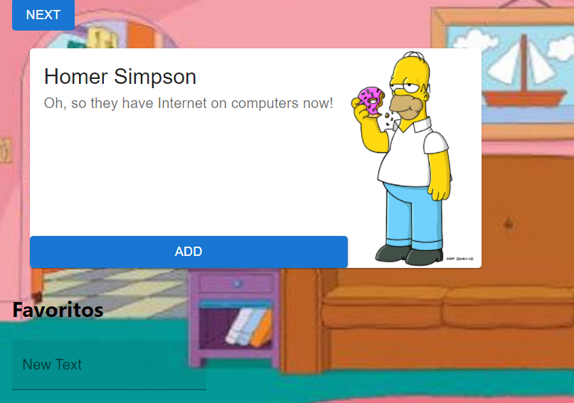
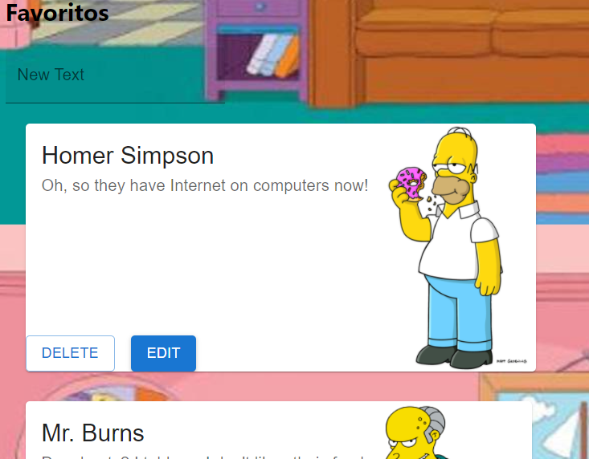
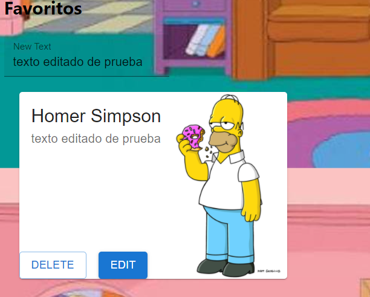

# consumo de API Simpsons con react

el proyecto usa el [api de los simpson](https://thesimpsonsquoteapi.glitch.me/), para obtener un valor aleatorio con una frace famosa de un personaje junto a su imagen.

## CRUD

el proyecto puede tomar el objeto y guardarlo si es que se selecciona en el boton de favoritos para precentarlo en otra seccion de las fraces seleccionadas.
o tambien existe el boton next que permite bbuscar otro objeto randomico de la misma naturaleza.

Para poder p
os objetos favoritos tambien se agrego dos botones para eliminar de la lista o aditar el comentario.
Para eliminar no hace mas falta que precionar el boton, y si se quiere editar una frace en la parte de arriba se tiene un pequeño imput que guardara y enviara la frace al objeto donde seleccionesmos edit, pero si el input esta vacio simplemente el comentario no se agrega.

Para el funcionamiento del sistema solo se uso un componenete que es el que viene por defecto [App.js](https://github.com/CarlosMontesdeoca/Api-Simpson/blob/material-ui/src/App.js), en este componente se maneja toda la logica y se usa componentes de material-ui para poder estilizar a el programa.
